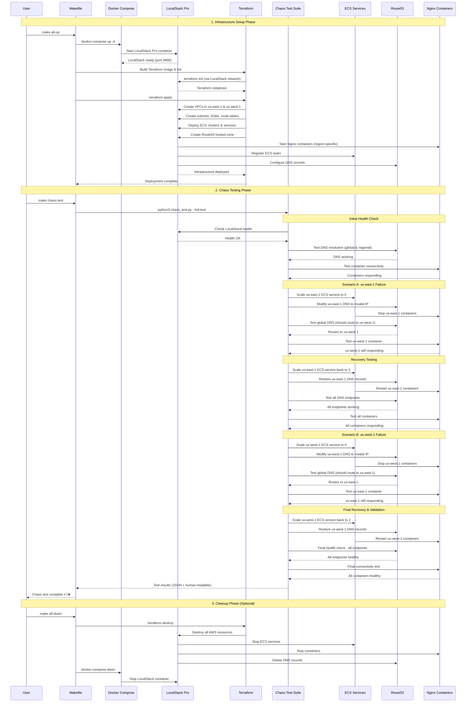

# LocalStack Pro with Terraform Multi-Region ECS Deployment

## Project Purpose

This project demonstrates how to use LocalStack Pro to emulate a complex AWS multi-region infrastructure locally for development and testing. It implements a resilient, multi-region architecture with the following features:

- **Multi-Region Deployment**: Deploys Nginx servers across both us-east-1 and us-west-1 regions
- **Latency-Based Routing**: Uses Route53 with latency-based routing to direct users to the closest region
- **Region-Specific Content**: Configures each region to serve region-specific content
- **Infrastructure as Code**: Uses Terraform to define and deploy the entire infrastructure
- **Local Development**: Runs entirely in LocalStack, allowing for fast, cost-effective testing

This setup provides a foundation for developing and testing globally distributed applications with high availability and low latency, all without incurring AWS costs during development.

## Prerequisites

- Docker and Docker Compose installed
- LocalStack Pro authentication token

## Development Environment Options

### Option 1: DevContainer (Recommended)

For the best development experience, use the provided DevContainer which includes all necessary tools pre-configured:

1. **Prerequisites:**
   - VS Code with the Dev Containers extension
   - Docker Desktop running

2. **Setup:**
   - Open this project in VS Code
   - When prompted, click "Reopen in Container"
   - Set your LocalStack Pro token: `export LOCALSTACK_AUTH_TOKEN=your-token`
   - Start development: `make localstack-up`

The DevContainer includes:
- Python 3.13 with development packages
- Docker & Docker Compose
- Terraform with latest version
- AWS CLI configured for LocalStack
- LocalStack CLI
- Useful aliases and development tools

See [.devcontainer/README.md](.devcontainer/README.md) for detailed information.

### Option 2: Local Setup

## Setup

1. Set your LocalStack Pro authentication token as an environment variable:

```bash
export LOCALSTACK_AUTH_TOKEN=your-localstack-pro-token
```

2. Start the LocalStack Pro and Terraform containers:

```bash
docker-compose up -d
```

3. Verify LocalStack is running:

```bash
curl http://localhost:4566/health
```

## Using the Makefile

The project includes a Makefile to simplify common operations:

```bash
# Start LocalStack and apply Terraform configuration
make start

# Stop all services
make stop

# Restart all services (stop and start)
make restart

# Show Terraform outputs
make outputs

# Plan Terraform changes
make plan

# Apply Terraform changes only
make apply

# Destroy infrastructure
make destroy

# Clean up everything (stop services and remove volumes)
make clean

# Show help
make help
```

## Running Terraform with Docker

The project includes a Dockerfile.terraform that packages the Terraform CLI with all necessary tools to apply configurations to LocalStack.

### Apply Terraform Configuration

```bash
docker-compose run terraform apply-localstack
```

This will:
1. Wait for LocalStack to be ready
2. Configure Terraform providers for LocalStack
3. Run `terraform init` and `terraform apply -auto-approve`

### Destroy Infrastructure

```bash
docker-compose run terraform destroy-localstack
```

### Run Custom Terraform Commands

```bash
docker-compose run terraform [command]
```

For example:
```bash
docker-compose run terraform plan
```

## How It Works - Sequence Diagram



## Architecture Overview

The infrastructure consists of the following components:

### Compute Layer
- **ECS Clusters**: Separate clusters in us-east-1 and us-west-1 regions
- **Fargate Tasks**: Running Nginx containers with region-specific configurations
- **Auto Scaling**: Configured to maintain high availability in each region

### Networking Layer
- **VPCs**: Isolated networks in each region with public and private subnets
- **NAT Gateways**: Providing outbound connectivity for private resources
- **Application Load Balancers**: Distributing traffic to ECS tasks in each region

### DNS Layer
- **Route53 Hosted Zone**: Managing the example.com domain
- **Latency-Based Routing**: Directing users to the closest region
- **Regional DNS Entries**: Allowing direct access to specific regions (e.g., us-east-1.example.com)

### Security Layer
- **Security Groups**: Controlling traffic to and from resources
- **IAM Roles**: Providing least-privilege permissions for ECS tasks

## Docker Compose Services

- **localstack-pro**: LocalStack Pro running on port 4666 (mapped from 4566 internally)
- **terraform-cli**: Terraform CLI configured to work with LocalStack

## Testing the Deployment

After successfully deploying the infrastructure, you can test the various endpoints:

### Testing Direct Container Access

```bash
# Access the US-East-1 Nginx container
curl -s http://localhost:32734

# Access the US-West-1 Nginx container
curl -s http://localhost:54262
```

### Testing Route53 DNS Entries

```bash
# Access the global endpoint (latency-based routing)
curl -s --resolve example.com:80:127.0.0.1 http://example.com

# Access the US-East-1 regional endpoint directly
curl -s --resolve us-east-1.example.com:80:127.0.0.1 http://us-east-1.example.com

# Access the US-West-1 regional endpoint directly
curl -s --resolve us-west-1.example.com:80:127.0.0.1 http://us-west-1.example.com
```

Note: The port numbers for direct container access may vary with each deployment. Use `docker ps | grep nginx` to find the current port mappings.

## Stopping the Services

```bash
make all-down
# or
docker-compose down
```

## Chaos Engineering Testing

This project includes a comprehensive chaos engineering test suite to validate the resilience of your multi-region deployment. The test suite simulates region failures and verifies that the remaining regions continue to serve traffic.

### Quick Start with Chaos Testing

```bash
# Complete workflow - deploy everything and run chaos tests
make chaos-test-full-workflow

# Or step by step
make all-up                    # Deploy LocalStack and infrastructure
make chaos-test                # Run full chaos test suite

# Individual test components (requires LocalStack running)
make chaos-test-quick          # Quick health check
make chaos-test-scenario-a     # Test us-east-1 failure
make chaos-test-scenario-b     # Test us-west-1 failure
```

### Chaos Test Features

- **Multi-Region Failure Simulation**: Tests both us-east-1 and us-west-1 failure scenarios
- **ECS Service Scaling**: Simulates region failures by scaling ECS services to zero
- **DNS Resolution Testing**: Validates Route53 global and regional endpoints
- **Container Connectivity**: Tests direct access to nginx containers
- **Automatic Recovery**: Restores services and validates full recovery
- **Comprehensive Reporting**: Generates detailed JSON and human-readable reports

### Test Scenarios

1. **Scenario A**: Disable us-east-1, verify us-west-1 continues serving traffic
2. **Scenario B**: Disable us-west-1, verify us-east-1 continues serving traffic

Each scenario includes:
- Initial health check
- Chaos injection (service scaling to 0)
- Resilience validation (remaining region works)
- Service restoration (scaling back to 2 tasks)
- Final health verification

For detailed documentation, see [CHAOS_TESTING.md](CHAOS_TESTING.md).

## Troubleshooting

### DNS Resolution Issues
If you have trouble resolving the Route53 DNS entries, ensure you're using the `--resolve` flag with curl as shown in the examples above.

### Container Access Issues
If container ports change after redeployment, use `docker ps | grep nginx` to find the new port mappings.

### LocalStack Authentication
If you encounter authentication issues with LocalStack Pro, verify your `LOCALSTACK_AUTH_TOKEN` is correctly set in your environment.

### DevContainer Issues
If you encounter issues with the DevContainer:
1. Ensure Docker Desktop is running
2. Try rebuilding the container: "Dev Containers: Rebuild Container"
3. Check the container logs for error messages
4. See [.devcontainer/README.md](.devcontainer/README.md) for troubleshooting tips
